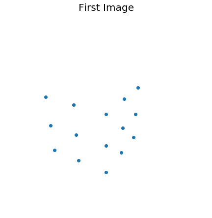
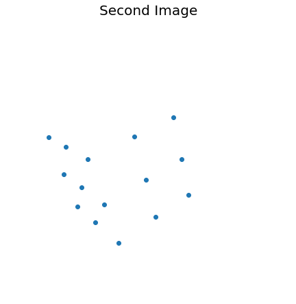
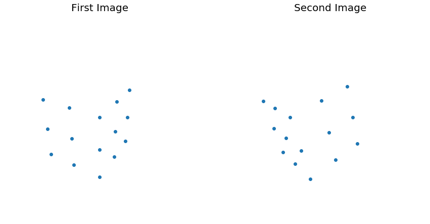
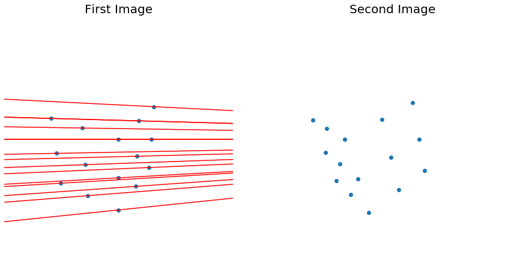
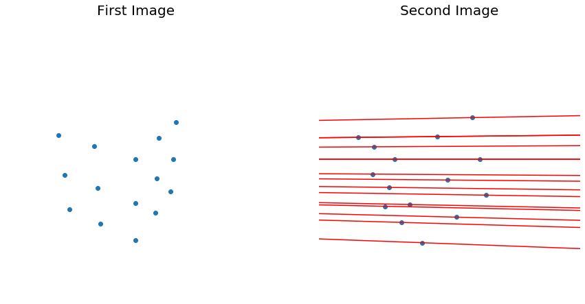

```python
import cv2
import numpy as np
from matplotlib import pyplot as plt
import math
```

# Structure From Motion

You can determine the positions of points in the scene and the motion of the camera.

## Epipolar Geometry

- The optical centers of the two cameras, a point $P$, and the image points $p_{0}$ and $p_{1}$ of $P$ all lie in the same plane (epipolar plane)
- These vectors are co-planar: $\vec{C_{0}p_{0}}, \vec{C_{1}p_{1}}, \vec{C_{0}C_{1}}$

- Now, instead of treating $p_{0}$ as a point, treat it as a 3D direction vector:

$$p_{0} = C_{0}\begin{pmatrix}
           x_{0} \\
           y_{0} \\
           1
         \end{pmatrix} $$
Here, we assume "normalized image coordinates (focal length of $1$)

- The same can be applied in the second photo's coordinate system:
$$p_{1} = C_{1}\begin{pmatrix}
           x_{1} \\
           y_{1} \\
           1
         \end{pmatrix} $$
- To find the direction of the second photo's coordinate system in the first photo, you need to apply some rotation matrix $R$ from the first photo's point, $p_{0}$, to the second photo's point, $p_{1}$.
$$ ^{C_{0}}_{C_{1}}Rp_{1}$$
- Don't forget! These vectors determine direction and not the starting point.

- We know that the points $p_{0}$ and $p_{1}$ are coplanar. This gives us the constraint
$$\vec{C_{0}p_{0}} \cdot \vec{C_{0}C_{1}} \times \vec{C_{1}p_{1}} =0 $$

- We can write the coplanar constraint as 
$$p_{0} \cdot (t \times Rp_{1}) = 0 $$

  - Where $R$ is the rotation of the first photo with respect to the second photo
  $$^{C_{0}}_{C_{1}}R $$
  - and $t$ is the translation of the first photo's origin with respect to the first photo
  $$ ^{C_{0}}t_{C_{1orig}} $$
  - Remember that the pose, $H$, of the first photo with respect to the second photo is a homogeneous transformation matrix:
  $$ ^{C_{0}}_{C_{1}}H = \begin{pmatrix}
  ^{C_{0}}_{C_{1}}R & ^{C_{0}}t_{C_{1orig}} \\
  0 & 1
  \end{pmatrix}$$
  
- We can replace the vector product with a skew symmetric-matrix for $t$
$$ p^{t}_{0}[t]_{x}R_{p_{1}} = 0$$
- We will let the essential matrix be the 3x3 matrix: $E=[t]_x R$.

- With all of this, we have the epipolar constraint:
$$ p^{T}_{0} E p_{1} = 0$$

$$
\begin{pmatrix}x_{0} & y_{0} & 1\end{pmatrix}
\begin{pmatrix}
    E_{11} & E_{12} & E_{13} \\
    E_{21} & E_{22} & E_{23} \\
    E_{31} & E_{32} & E_{33}\end{pmatrix}
\begin{pmatrix}x_{1} \\ y_{1} \\ 1\end{pmatrix}
=0
$$


### Essential Matrix
- The matrix $E$, that relates the image of a point in one camera to its image in the other camera, given a translation and rotation.
- With known coordinates, we can project/render images.


```python
image_size = 300
image_1 = np.zeros((image_size, image_size))
```

With a blank image, we can define pose, $H$. This will be composed of the focal length $f$ and the translation to position 0.


```python
f = image_size
u_0 = image_size/2
v_0 = image_size/2
H = np.matrix([
    [f, 0, u_0],
    [0, f, v_0],
    [0, 0, 1]])
```

With the pose defined, we can define points on the cube.


```python
points = np.array([
    [0, 2, 0, 1], 
    [0, 1, 0, 1],
    [0, 0, 0, 1],
    [0, 2, -1, 1],
    [0, 1, -1, 1],
    [0, 0, -2, 1],
    [0, 2, -2, 1],
    [0, 1, -2, 1],
    [0, 0, -2, 2],
    [1, 0, 0, 1],
    [2, 0, 0, 1],
    [1, 0, -1, 1],
    [2, 0, -1, 1],
    [1, 0, -2, 1],
    [2, 0, -2, 1]
]).transpose()
```

With the points on the cube defined, we can rotate and translate the camera into its first position. We can do this by using an extrinsic camera parameter matrix, `M`. This matrix represents the camera rotated 120 degrees in the x coordinate system and 60 degrees in the z coordinate system. The camera is also translated 5 units in the z direction.


```python
a_x = 120 * (math.pi/180)
a_y = 0 * (math.pi/180)
a_z = 60 * (math.pi/180)
translate_0 = np.matrix([[0], [0], [5]])
R_x = np.matrix([
    [1, 0, 0],
    [0, math.cos(a_x), -math.sin(a_x)],
    [0, math.sin(a_x), math.cos(a_x)]
])
R_y = np.matrix([
    [math.cos(a_y), 0, math.sin(a_y)],
    [0, 1, 0],
    [-math.sin(a_y), 0, math.cos(a_y)]
])
R_z = np.matrix([
    [math.cos(a_z), -math.sin(a_z), 0], 
    [math.sin(a_z), math.cos(a_z), 0], 
    [0, 0, 1]
])
M = np.append(R_x * R_y * R_z, translate_0, 1)
points_1 = M * points
```

With the first image's focal length, $f_1$, and the point's distance from the camera, $Z_1$, set, we can render the individual points, $p_i$.

$$p_i = (f_1 / Z_1)P_1$$

We then need to convert the normalized image points to be unnormalized.


```python
points_1[0,:] = points_1[0,:] / points_1[2,:]
points_1[1,:] = points_1[1,:] / points_1[2,:]
points_1[2,:] = points_1[2,:] / points_1[2,:]
u_1 = H * points_1
for row in u_1.transpose():
    image_1[int(row[0, 0])-2:int(row[0, 0])+2, int(row[0, 1])-2:int(row[0, 1])+2] = 255
plt.figure(1, figsize = (7.5,7.5))
axes = plt.gca()
axes.scatter(
    [x[0] for x in u_1.transpose()[:,0].tolist()],
    [300-y[0] for y in u_1.transpose()[:,1].tolist()]
)
axes.set_xlim([0, 300])
axes.set_ylim([0, 300])
axes.set_title("First Image", size=20)
axes.axis("off")
plt.show()
```





With the first image rendered, we can use the same calculations to move the camera again.


```python
a_x = 0 * (math.pi/180)
a_y = -25 * (math.pi/180)
a_z = 0 * (math.pi/180)
translate_1 = np.matrix([[3], [0], [1]])
R_x = np.matrix([
    [1, 0, 0],
    [0, math.cos(a_x), -math.sin(a_x)],
    [0, math.sin(a_x), math.cos(a_x)]
])
R_y = np.matrix([
    [math.cos(a_y), 0, math.sin(a_y)],
    [0, 1, 0],
    [-math.sin(a_y), 0, math.cos(a_y)]
])
R_z = np.matrix([
    [math.cos(a_z), -math.sin(a_z), 0], 
    [math.sin(a_z), math.cos(a_z), 0], 
    [0, 0, 1]
])
M_c1 = np.append(R_x * R_y * R_z, translate_1, 1)
```

With the extrinsic matrix created for the translation of camera 1 to camera 2, the different poses can be found. The pose of the start of the camera with respect to the camera's first position is created by appending the a row for rotation. The same is applied to the pose of the second position to the first position.


```python
H_m_c1 = np.vstack([M, [0, 0, 0, 1]])
H_c2_c1 = np.vstack([M_c1, [0, 0, 0, 1]])
H_c1_c2 = np.linalg.inv(H_c2_c1)
H_m_c2 = H_c1_c2 * H_m_c1
```


```python
R_m_c2 = H_m_c2[0:3,0:3]
translate_0_2 = H_m_c2[0:3,3]
M = np.append(R_m_c2, translate_0_2, 1)
```


```python
image_2 = np.zeros((image_size, image_size))
points_2 = np.vstack([
    (M * points)[0,:] / (M * points)[2,:],
    (M * points)[1,:] / (M * points)[2,:],
    (M * points)[2,:] / (M * points)[2,:]
])
u_2 = H * points_2
for row in u_2.transpose():
    image_2[int(row[0, 0])-2:int(row[0, 0])+2, int(row[0, 1])-2:int(row[0, 1])+2] = 255
    
plt.figure(1, figsize = (7.5,7.5))
axes = plt.gca()
axes.scatter(
    [x[0] for x in u_2.transpose()[:,0].tolist()],
    [300-y[0] for y in u_2.transpose()[:,1].tolist()]
)
axes.set_xlim([0, 300])
axes.set_ylim([0, 300])
axes.set_title("Second Image", size=20)
axes.axis("off")
plt.show()
```





```python
E = np.matrix([
    [0, -float(translate_1[2][0]), float(translate_1[1][0])],
    [float(translate_1[2][0]), 0, float(-translate_1[0][0])],
    [-float(translate_1[1][0]), float(translate_1[0][0]), 0]
]) * M_c1
E = np.delete(E, -1, axis=1)
E
```


    matrix([[ 0.        , -1.        ,  0.        ],
            [-0.361547  ,  0.        , -3.14154162],
            [ 0.        ,  3.        ,  0.        ]])


### Calculating the Essential Matrix

Remember the Essential matrix, $E$? It relates the image of a point in one image to its location in another image by a given rotation and/or translation,
$$ p^{T}_{0} E p_{1} = 0 \text{,}$$
where
$$E=[t]_x R\text{.}$$

We can calculate $E$ if we know the pose between the two images. We can also calculate $E$ from a set of known point correspondences.

Now, $E$ is a 3x3 matrix with 9 unknowns. Again, there is a scale factor, which helps us out by letting us know that there are actually only 8 unknowns. With 8 equations, we can calculate $E$ from 8 or more related points between images. We can simplify the equation as follows:

$$
\begin{pmatrix}x_{0} & y_{0} & 1\end{pmatrix}
\begin{pmatrix}
    E_{11} & E_{12} & E_{13} \\
    E_{21} & E_{22} & E_{23} \\
    E_{31} & E_{32} & E_{33}\end{pmatrix}
\begin{pmatrix}x_{1} \\ y_{1} \\ 1\end{pmatrix}
=0
$$

$$
\begin{pmatrix}x_{0} & y_{0} & 1\end{pmatrix}
\begin{pmatrix}
    E_{11}x_{1} + E_{12}y{1} + E_{13} \\
    E_{21}x_{1} + E_{22}y_{1} + E_{23} \\
    E_{31}x_{1} + E_{32}y_{1} + E_{33}\end{pmatrix} = 0
$$

$$
E_{11}x_{1}x_{0} + E_{12}y{1}x_{0} + E_{13}x_{0} +\\
E_{21}y_{0}x_{1} + E_{22}y_{0}y_{1} + E_{23}y_{0} +\\
E_{31}x_{1} + E_{32}y_{1} + E_{33} = 0
$$

With this equation, we can write it as a matrix equation by separating the unknowns from the known variables.

$$
\begin{pmatrix} x_{0}x_{1} & x_{0}y_{1} & x_{0} & y_{0}x_{1} & y_{0}y_{1} & y_{0} & x_{1} & y_{1} & 1 \end{pmatrix}
\begin{pmatrix} E_{11} \\ E_{12} \\ E_{13} \\ \vdots \\ E_{33}\end{pmatrix} = 0
$$

With this system of homogeneous equations, we can ignore the trivial solution, $x=0$, and find a unique solution that gives the smallest error. This means that we need to minimize 
$$\sum (p^{T}_{0} E p_{1})^{2} \text{,}$$
since we know that it *should* be 0.

We can use singular value decomposition, SVD, to solve for $x$.
$$
A = U D V^{T}
$$

The solution of $x$ is the column of $V$ corresponding to the only null singular value of $A$. In this scenario, the rightmost column of $V$ is the solution we are looking for.

---

The first step in this process is to scale and translate the image points so that the centroid of all the points is found at the origin. In order to do this, we first need to calculate the centroids of all the ($x$, $y$) coordinates found in the first image.


```python
x_n = points_1[0:2, :]
N = x_n.shape[1]
t = np.sum(x_n, axis=1) / N
```

With this we can center the points to the origin, find the distance from the centroid of all the centered points, `dc`, and then calculate a scale factor `s` that we can use to scale the points to have an average distance of $\sqrt{2}$ from the origin.


```python
xnc = x_n - t * np.ones((1,N))
dc = np.sqrt(np.sum(np.power(xnc, 2).transpose(), axis=1))
d_avg = 1 / N * np.sum(dc)
s = np.sqrt(2) / d_avg
```

Now we can create the $t$ matrix with the scale factor and the distance from the centroid we found earlier.


```python
t_1 = np.zeros((2, 2), float)
np.fill_diagonal(t_1, s)
t_1 = np.vstack([np.hstack([t_1, -s * t]), [0, 0, 1]])
points_1_scaled = t_1 * points_1
```

We can do the same thing with the second set of points we found earlier.


```python
x_n = points_2[0:2, :]
N = x_n.shape[1]
t = np.sum(x_n, axis=1) / N
xnc = x_n - t * np.ones((1,N))
dc = np.sqrt(np.sum(np.power(xnc, 2).transpose(), axis=1))
d_avg = 1 / N * np.sum(dc)
s = np.sqrt(2) / d_avg
t_2 = np.zeros((2, 2), float)
np.fill_diagonal(t_2, s)
t_2 = np.vstack([np.hstack([t_2, -s * t]), [0, 0, 1]])
points_2_scaled = t_2 * points_2
```

In order to do our SVD, we first need to create the $A$ matrix:
$$\begin{pmatrix} x_{0}x_{1} & x_{0}y_{1} & x_{0} & y_{0}x_{1} & y_{0}y_{1} & y_{0} & x_{1} & y_{1} & 1 \end{pmatrix}\text{.}$$

Because we have 15 unique points, the A matrix will be 15x9.


```python
A = np.hstack([
    np.multiply(points_1_scaled[0,:].transpose(), points_2_scaled[0,:].transpose()),
    np.multiply(points_1_scaled[0,:].transpose(), points_2_scaled[1,:].transpose()),
    points_1_scaled[0,:].transpose(),
    np.multiply(points_1_scaled[1,:].transpose(), points_2_scaled[0,:].transpose()),
    np.multiply(points_1_scaled[1,:].transpose(), points_2_scaled[1,:].transpose()),
    points_1_scaled[1,:].transpose(),
    points_2_scaled[0,:].transpose(),
    points_2_scaled[1,:].transpose(),
    np.matrix(np.ones(15)).transpose()
])
```

With the $A$ matrix created, we can calculate the SVD of $A$.


```python
[U, D, V] = np.linalg.svd(A)
x = V[8, :]
E_scaled = np.reshape(V[8, :].tolist(), (3,3))
```

Now, we can force rank=2 and equal Eigenvalues in our scale.


```python
[U, D, V] = np.linalg.svd(E_scaled)
E_scaled = U * np.diag([1, 1, 0]) * V.transpose()
```


```python
E_compute =  t_1.transpose() * E_scaled * t_2
E_compute
```


    matrix([[ 2.45762485e-02,  0.00000000e+00,  2.86903168e-03],
            [ 0.00000000e+00, -1.72134999e+01,  1.22562695e+00],
            [ 9.64260721e-04,  1.21033188e+00, -8.60648732e-02]])


### Recovering Motion From The Essential Matrix

With the essential matrix, you can recover relative motion between images. We know that the Essential matrix is composed of the translation and rotation:
$$E=[t]_x R\text{.}$$

How do you recover this information? Again, you can use the SVD of $E$, 
$$E = U D V^{T}\text{,}$$
to recover $t$ and $R$.

The translation, $t$, is either $u_3$ or $-u_3$, where $u_3$ is the last column of $U$. The rotation, $R$ is either $UWV^{T}$ or $UW^{T}V^{T}$, where
$$
W = \begin{pmatrix}
0 & -1 & 0 \\
1 & 0 & 0 \\
0 & 0 & 1
\end{pmatrix} \text{.}
$$

This gives us 4 possible solutions. Luckily, 3 of the solutions support ideas that the points are behind the camera. We can rule these out. Our solution is homogeneous, which means that we can scale it by any constant, $k$, and get valid results. This gives us a correct rotation, $R$, but a translation, $t$, of an arbitrary amount.

---

First, we can calculate the SVD of $E$ and define $W$.


```python
[U, D, V] = np.linalg.svd(E)
W = np.matrix([
    [0, -1, 0],
    [1, 0, 0],
    [0, 0, 1]
])
```

Now, we can calculate our 4 possible solutions.


```python
results = [
    np.vstack([np.hstack([U*W*V.transpose(),  U[:,2]]), [0,0,0,1]]),
    np.vstack([np.hstack([U*W*V.transpose(), -U[:,2]]), [0,0,0,1]]),
    np.vstack([np.hstack([U*W.transpose()*V.transpose(),  U[:,2]]), [0,0,0,1]]),
    np.vstack([np.hstack([U*W.transpose()*V.transpose(), -U[:,2]]), [0,0,0,1]])
]
# for result in results:
#     print(result)
results[3]
```


    matrix([[ 0.90630779,  0.        ,  0.42261826,  0.9486833 ],
            [ 0.        ,  1.        ,  0.        , -0.        ],
            [ 0.42261826,  0.        , -0.90630779,  0.31622777],
            [ 0.        ,  0.        ,  0.        ,  1.        ]])


```python
E
```


    matrix([[ 0.        , -1.        ,  0.        ],
            [-0.361547  ,  0.        , -3.14154162],
            [ 0.        ,  3.        ,  0.        ]])


```python
U
```


    matrix([[ 0.        , -0.31622777, -0.9486833 ],
            [ 1.        ,  0.        ,  0.        ],
            [ 0.        ,  0.9486833 , -0.31622777]])


### Epipolar Lines

You can draw any line on a 2D plane with the equation $ax + by + c = 0$. The issue we face while trying to draw lines between these points, is that you can scale this equation by any constant, $k$, and the constraint is still meet: $(ka)x+(kb)y + (kc)=0$.

So, if we say that a line may be represented as a set of homogeneous coordinates:
$$I = (a,b,c)^{T}\text{,}$$
we can say that the point $p$ lies on the line $l$ if and only if $p^{T}l=0$

$$p^{T}l=
\begin{pmatrix}x & y & z\end{pmatrix}
\begin{pmatrix}a \\ b \\ c \end{pmatrix}
=ax +by + cz
$$

With that out of the way, the constraint of the epipolar line, 
$$p_{0}^{T} E p_{1} = 0 \text{,}$$
allows us to draw lines on the images that are on the epipolar plane
$$
\begin{pmatrix}x_{0} & y_{0} & 1\end{pmatrix}
\begin{pmatrix}a \\ b \\ c \end{pmatrix} = 
ax_{0} + by_{0} + c = 0\text{.}
$$


```python
fig, axes = plt.subplots(nrows=1, ncols=2, figsize=(15, 7.5))
axes[0].scatter(
    [x[0] for x in u_1.transpose()[:,0].tolist()],
    [300-y[0] for y in u_1.transpose()[:,1].tolist()])
axes[0].set_xlim([0, 300])
axes[0].set_ylim([0, 300])
axes[0].set_title("First Image", size=20)
axes[0].axis("off")
axes[1].scatter(
    [x[0] for x in u_2.transpose()[:,0].tolist()],
    [300-y[0] for y in u_2.transpose()[:,1].tolist()])
axes[1].set_xlim([0, 300])
axes[1].set_ylim([0, 300])
axes[1].set_title("Second Image", size=20)
axes[1].axis("off")
plt.show()
```





```python
fig, axes = plt.subplots(nrows=1, ncols=2, figsize=(15, 7.5))
axes[0].scatter(
    [x[0] for x in u_1.transpose()[:,0].tolist()],
    [300-y[0] for y in u_1.transpose()[:,1].tolist()])
axes[0].set_xlim([0, 300])
axes[0].set_ylim([0, 300])
axes[0].set_title("First Image", size=20)
axes[0].axis("off")
axes[1].scatter(
    [x[0] for x in u_2.transpose()[:,0].tolist()],
    [300-y[0] for y in u_2.transpose()[:,1].tolist()])
axes[1].set_xlim([0, 300])
axes[1].set_ylim([0, 300])
axes[1].set_title("Second Image", size=20)
axes[1].axis("off")
for index in range(0, len(points_1.transpose())):
    l = E * points_2[:,index]
    error = float(points_1[:,index].transpose() * E * points_2[:,index])
    p_line_0 = H * np.matrix([
        [-1],
        [float((-l[2]-l[0]*(-1))/l[1])],
        [1]
    ])
    p_line_1 = H * np.matrix([
        [1],
        [float((-l[2]-l[0])/l[1])],
        [1]
    ])
    axes[0].plot(
        (float(p_line_0[0]), float(p_line_1[0])),
        (300-float(p_line_0[1]), 300-float(p_line_1[1])),
        'ro-'
    )
plt.show()
```





```python
fig, axes = plt.subplots(nrows=1, ncols=2, figsize=(15, 7.5))
axes[0].scatter(
    [x[0] for x in u_1.transpose()[:,0].tolist()],
    [300-y[0] for y in u_1.transpose()[:,1].tolist()])
axes[0].set_xlim([0, 300])
axes[0].set_ylim([0, 300])
axes[0].set_title("First Image", size=20)
axes[0].axis("off")
axes[1].scatter(
    [x[0] for x in u_2.transpose()[:,0].tolist()],
    [300-y[0] for y in u_2.transpose()[:,1].tolist()])
axes[1].set_xlim([0, 300])
axes[1].set_ylim([0, 300])
axes[1].set_title("Second Image", size=20)
axes[1].axis("off")
for index in range(0, len(points_2.transpose())):
    l = E.transpose() * points_1[:,index]
    p_line_0 = H * np.matrix([
        [-1],
        [float((-l[2]-l[0]*(-1))/l[1])],
        [1]
    ])
    p_line_1 = H * np.matrix([
        [1],
        [float((-l[2]-l[0])/l[1])],
        [1]
    ])
    axes[1].plot(
        (float(p_line_0[0]), float(p_line_1[0])),
        (300-float(p_line_0[1]), 300-float(p_line_1[1])),
        'ro-'
    )
plt.show()
```




