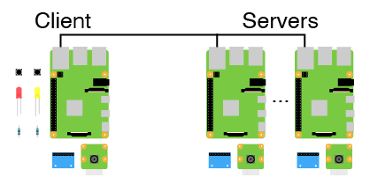
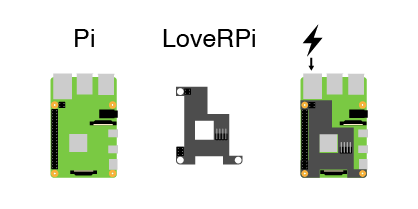
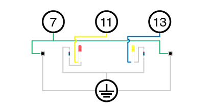
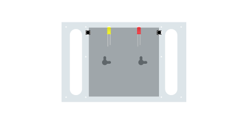
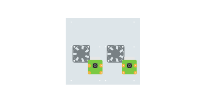

# Raspberry Pi Camera System

## Version 1

This system uses multiple Raspberry Pi computers to take images and read sensor data to reconstruct real world geometry using photogrammetric techniques. This version will use a single Pi as a client accessing other Pis acting as servers. Each Raspberry Pi will have its own camera and accelerometer. The single client will have a couple buttons and LEDs, and the client Raspberry Pi decides when to start a recording. This client will access the other computers through Transmission Control Protocol, TCP, telling them when to start and stop a recording.

TCP limits the types of connections used between the different Raspberry Pis. This means that a network switch is needed to network the traffic. The TP-Link 5 Port Gigabit PoE Switch was used to connect 2 Raspberry Pis. This switch offers power of ethernet, POE, allowing the Raspberry Pis to be powered and networked over a single cable. The Raspberry Pi 4 does not support POE out of the box. An additional PCB is required to use the POE feature. The LoveRPi POE Hat supplies the required power to the Raspberry Pis, but this hat produces a lot heat. 30mm fans were used to cool the power management chips on the hat to ensure stable performance. 

The system uses buttons and LEDs. These are wired to the 7, 9, 11, and 13 GPIO pins. The 7, 11, and 13 pins are programmable while the 9 pin is ground.

The cheapest and easiest way to assemble all of these parts was to use a few sheets of acrylic to "sandwich" the parts together. The back sheet supports the buttons, the LEDs, and the network switch.

The middle sheet supports the accelerometers and the Pi's.

The front sheet supports the fans and the cameras.

After assembling the three sheets, they are bolted together using standoffs. 

### Software
 tyler